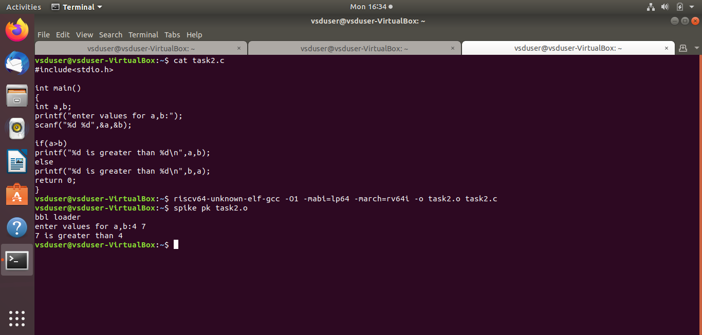

# task1
A C program computes the sum of integers from 1 to N by inputting N, using a for loop to calculate the sum, and displaying the result. The program is compiled using a RISC-V compiler. The generated assembly code is inspected ,efficiency is analyzed by counting instructions in the main function with optimizations: O1-15 and Ofast-12 instructions.
# Image Descriptions

## Image 1

Description:Simple C program is compiled to obtain an object file for the RISC-V 64-bit architecture (rv64i) with the LP64 ABI (64-bit integers and pointers) and different optimization flags -O1 and -Ofast are applied to observe their performance.Compiled object file (task2.o) is executed using the Spike RISC-V simulator with the PK (proxy kernel), which simulates the execution of the program as if it were running on a RISC-V processor.

