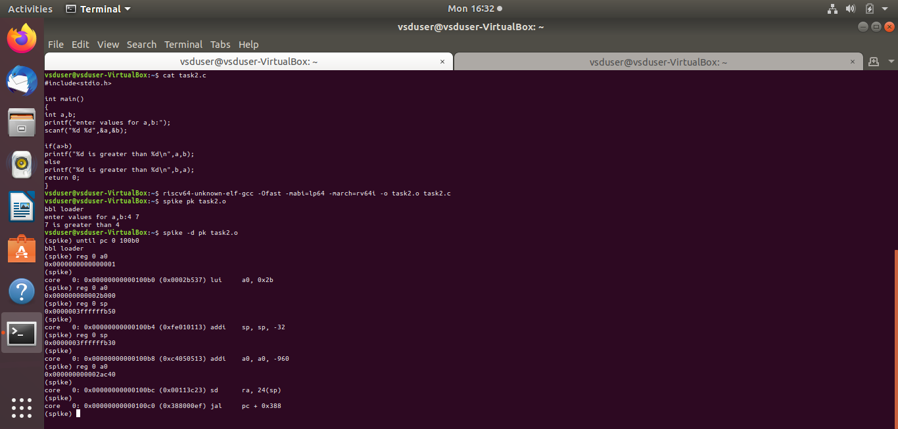

Basic Details About Me
Name: Monisha Suresh
College: Vidyavardhaka College of Engineering
Email ID: gokulgr993@gmail.com
LinkedIn Profile: Gokul GR

Task 1: Install the RISC-V toolchain using the VDI link and Perform GCC Compilation In Both Normal gcc-compiler and RISC-V Based gcc compiler and check the result.
Task 2:: To write a simple C program and to compile the C program using RISC-V GCC/SPIKE with the O1 and Ofast optimization flags and to generate and collect the RISC-V object dump for both -O1 and -Ofast
# Task1
A C program computes the sum of integers from 1 to N by inputting N, using a for loop to calculate the sum, and displaying the result. The program is compiled using a RISC-V compiler. The generated assembly code is inspected ,efficiency is analyzed by counting instructions in the main function with optimizations: O1-15 and Ofast-12 instructions.
# Image Descriptions

## Task2- Compiled C Code

Description:Simple C program is compiled to obtain an object file for the RISC-V 64-bit architecture (rv64i) with the LP64 ABI (64-bit integers and pointers) and different optimization flags -O1 and -Ofast are applied to observe their performance.Compiled object file (task2.o) is executed using the Spike RISC-V simulator with the PK (proxy kernel), which simulates the execution of the program as if it were running on a RISC-V processor.

## Task2- Output 1(-O1 optimization flag)

Description:Debugging mode is enebled, which provides more detailed output, such as register and memory information during execution. The image shows that how the register a0 is updated using assembly instruction addi a0,a0,-960 [-960 is added to the data of register a0 and is updated] content of a0 is checked before and after the execution of instruction.

## Task2- Output 1(-O1 optimization flag)

Description:Debugging mode is enebled, which provides more detailed output, such as register and memory information during execution. The image shows that how the stack pointer sp is updated using assembly instruction addi sp, sp, -32 [-32 is added to the sp and is updated] content of sp is checked before and after the execution of instruction.

## Task2- Output 2(-Ofast optimization flag)

Description:Debugging mode is enebled, which provides more detailed output, such as register and memory information during execution. The image shows the execution of instructions which is similar to that of output 1(-O1 optimization flag).-Ofast tends to optimize for execution speed, which may involve reducing instruction count by simplifying and combining operations, while -O1 applies more cautious optimizations.

## Task2- Output 2(-Ofast optimization flag)

Description:Debugging mode is enebled, which provides more detailed output, such as register and memory information during execution. The image shows the execution of instructions which is similar to that of output 1(-O1 optimization flag).Ofast results in advanced optimizations that might remove or combine operations that -O1 leaves intact.
